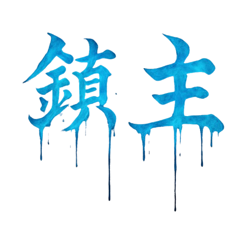
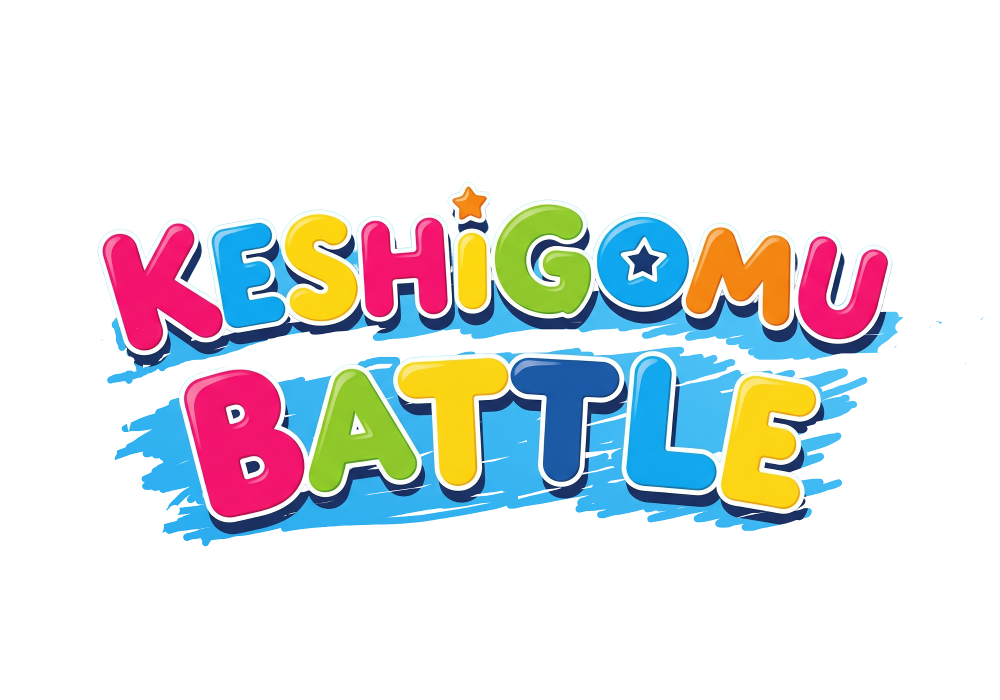
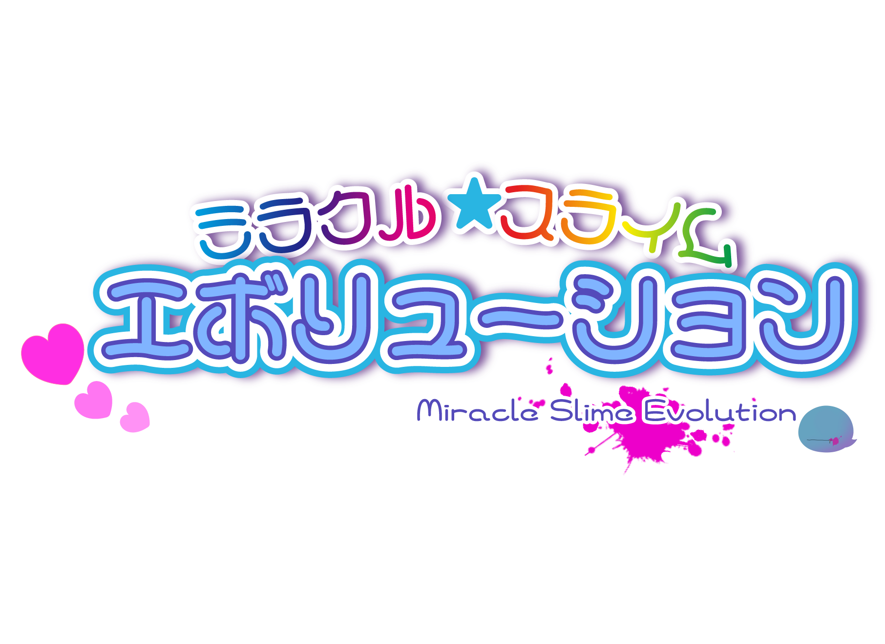
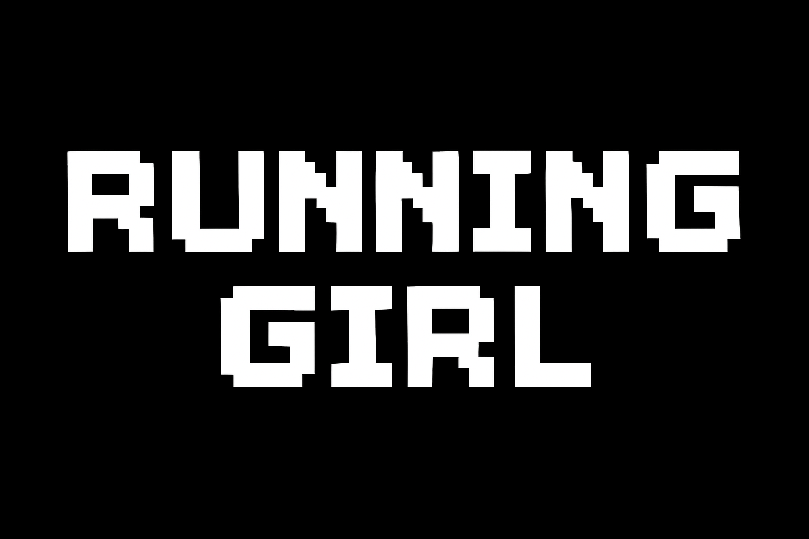

# gushiriu-portfolio
ScratchとUnityで制作したゲーム集（ホラー・対戦・アクション・2D）  
ScratchとUnityroomで公開中　PDFポートフォリオ付き

## 自己紹介
沖縄みらいAI & IT専門学校 一年次在籍中  
UnityとScratchを用いたゲーム開発経験あり

## PDFポートフォリオ
- [具志俐初 ポートフォリオ.pdf](./具志俐初%20ポートフォリオ.pdf)

## Scratch作品
### 鎮主（探索ホラーゲーム）
  
使用ツール：Scratch  
役割：サブリーダー兼プログラマー  
URL: [Scratch「鎮主」](https://scratch.mit.edu/projects/1245579611)

## Unity作品
### KESHIGOMU BATTLE（3D対戦ゲーム）
  
使用ツール：Unity  
役割：プログラマー  
URL: [Unityroom「KESHIGOMUBATTLE」](https://unityroom.com/games/kesibato)

### Miracle Slime Evolution（3Dアクション）
  
使用ツール：Unity  
役割：プログラマー(エフェクト担当)  
URL: [Unityroom「ミラクル☆スライムエボリューション」](https://unityroom.com/games/miracle)

### RUNNING GIRL（2Dアクション）
  
使用ツール：Unity  
役割：ALL(個人製作)  
URL: [Unityroom「RUNNING GIRL」](https://unityroom.com/games/runninggirl)
